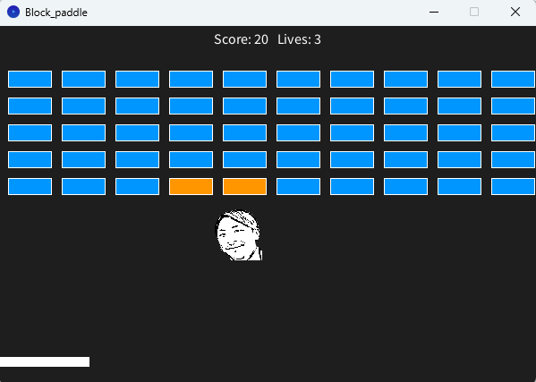

# 課題タイトル

例：ブロック崩し

---

## 学籍番号・氏名

* 学籍番号：xxxxxxx
* 氏名：xxxxxx

---

## 課題概要

この課題で制作したプログラムについて、どのような作品なのか簡潔に説明してください。

例：

> マウス操作でバーを動かし、ボールを跳ね返してブロックを消していくブロック崩しゲームを制作しました。

---

## 使用技術・ライブラリ

* 使用言語：Processing (Java)
* 使用ライブラリ：

  * なし
  * 例：Minim
  * 例：ControlP5
  * 例：OpenCV for Processing

---

## 制作の工夫ポイント

この作品を制作する際に工夫した点を説明してください。

* 例：マウス操作によってバーを左右に動かせるようにした
* 例：ボールとブロックの衝突判定を実装した
* 例：ゲームオーバー後にRキーで再スタートできるようにした

---

## 難しかった点・学んだこと

### 難しかった点

実装する際に難しかったことや、思うようにいかなかったことを書いてください。

例：

> ボールとブロックが衝突したかどうかを判定する処理が難しかった。

### 学んだこと

この課題を通して新しく理解できたことを書いてください。

例：

> 配列を使って複数のブロックをまとめて管理する方法を学んだ。
> if文を使った衝突判定の方法を学んだ。

---

## 生成AIの利用について

### 使用した生成AI

使用した生成AIを記載してください。

例：

* ChatGPT
* Gemini
* GitHub Copilot
* その他：○○

### 生成AIを使用した場面

生成AIを何のために使用したのか記載してください。

例：

* Processingの文法や関数について質問した
* プログラムのエラーの原因を調べた
* プログラムの一部を作成する際の参考にした
* プログラムの改善案を考えるために使用した
* アイデアを考えるために使用した

### 生成AIに入力した内容

生成AIにどのような質問や指示をしたのか、代表的なものを記載してください。

例：

> 「Processingでマウスを使ってバーを左右に動かすにはどうすればよいですか？」

> 「以下のプログラムでNullPointerExceptionが発生する原因を説明してください。」

### 生成AIから得たものをどのように利用したか

生成AIから得た回答やプログラムを、そのまま使用したのか、自分で修正したのかなどを説明してください。

例：

> 生成AIが提示したプログラムを参考にし、自分のプログラムに合わせて変数名や処理内容を変更しました。

### 生成AIの回答を確認・修正したこと

生成AIの回答について、自分で確認したことや修正したことを記載してください。

例：

> 生成AIが提示したコードを実際にProcessingで実行し、エラーが発生した部分を修正しました。
> 動作を確認しながら、自分の目的に合わない処理を変更しました。

---

## 今後の改善・発展アイデア

現在の作品をさらに改善・発展させるとしたら、どのような機能を追加したいかを書いてください。

* 例：ステージを複数用意する
* 例：スコアやハイスコアを記録する
* 例：効果音やBGMを追加する
* 例：ゲームの難易度を選択できるようにする

---

## 実行方法

### Processingで実行する場合

1. GitHubからリポジトリをダウンロードする
2. sketchフォルダをProcessingで開く
3. `.pde` ファイルを開く
4. Processingの「実行」ボタンを押す

### 注意点

* 使用しているライブラリは、事前にインストールしてください。
* 画像・音声などの外部ファイルは、指定されたフォルダに配置してください。
* （その他、実行するために必要な設定があれば記載してください。）

---

## スクリーンショット / GIF
例：
